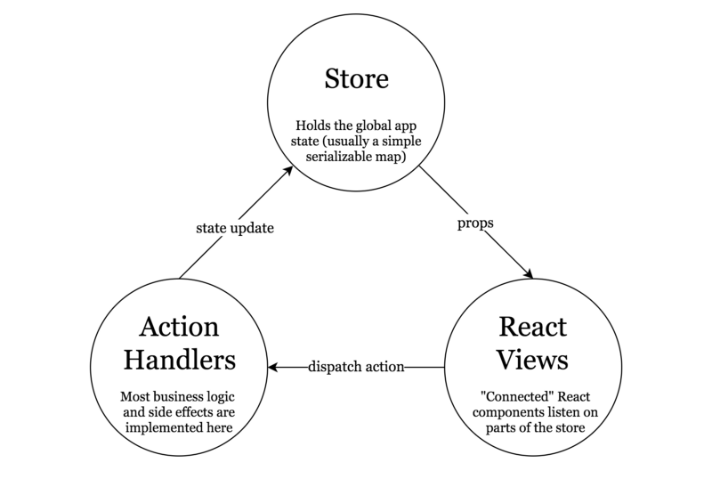
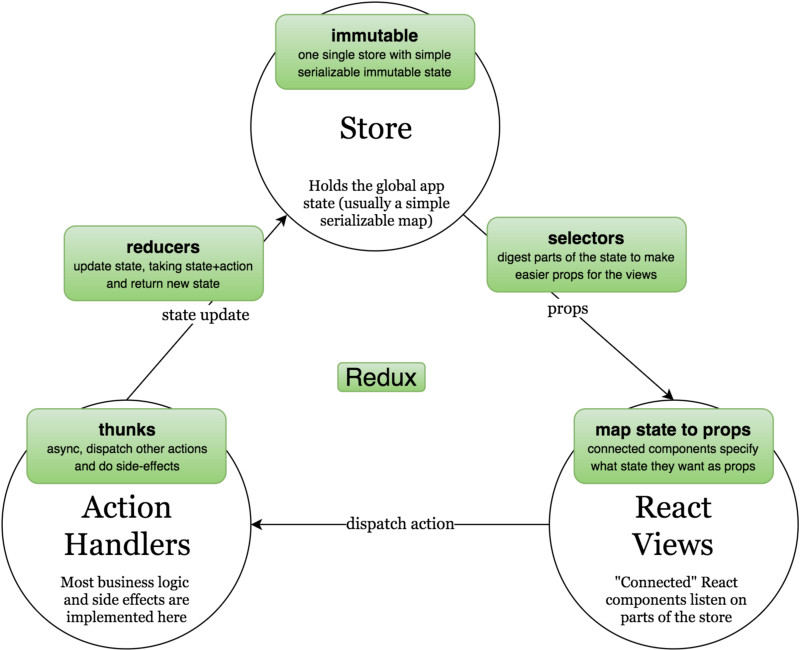

# Introduction to Redux.
Redux is a predictable state container for JavaScript apps.

Hi mates.

## Resume
React è semplice, facile da capire, veloce da implementare
_MA_
- Nei progetti più grandi, la gestione di piccoli e singoli componenti rischierebbe di disprdersi
- Le dipendenze dei vari componenti tra loro idem
- Gestire tutta la logica all'interno di un componente è dispersivo e poco chiaro (_L'app rischia di non essere più reactive_).

Redux, basato su Flux, ci permette di implementare la nostra soluzione di react in maniera molto più strutturata.
_Flux_ è , prima di tutto, un pattern archietetturale. 

Visto come è finito il talk della settimana precedente, dove _ci fu una grande battaglia di idee e alla fine non ci furono né vincitori né vinti né idee_ , l'idea è quella di farvi vedere velocemente come strutturare un qualsiasi progetto per poi parlare insieme della logica dell'architettura di flux e dei metodi reali di utilizzo al fine di capire insieme come e se potremmo inserire questa nuova tecnologia in reMedia.

Il flusso di un applicazione strutturata con l'architettura Flux è: 

Una delle difficoltà maggiori nell'iniziare a usare redux non è tanto capire il flusso qui sopra, ma gestire tutti i termini che prevede. Inseriamoli in questo grafico.

### 2 - Let's structure!
Probabilmente non è sicuramente una struttua che potrebbe andare bene per enormi applicazioni, ma ecco come ho strutturato l'app che andremo a vedere. 

> mkdir src/components
  Metteremo qui tutti i componenti di React che non hanon niente a che fare con Redux
> mkdir src/containers
  Per container si intendono i componenti di React che sono collegati con le store di Redux
> mkdir src/services
Mh. Servizi. 
- Piccolo appunto, i servizi devono essere StateLess. Questo significa che funzionano a prescidere dello stato dell'applicazione.
Per esempio, se dovessimo autenticarci potremmo essere tentanti ad inserire l'autenticazione direttamente nel servizio, mentre bisognerebbe gestire un altra store con un altro service di autenticazione.
> src/store
 Tutto il codice di Redux va qui, compresa la business-logic del progetto.

Organizziamo quindi la cartella store per domains, cioè qualcosa come: 
> src/store/{domain}/reducer.js
Reducer as a default export with all selectors as named exports
> src/store/{domain}/actions.js
All the domain action handlers (thunks and plain object creators)

Dalla cartella Store deve uscire un unica store che contiene tutto lo state del progetto, ecco quindi che inseriamo un file dove andremo poi a mettere tutti i reducer dell'applicazione:

> import topics from './topics/reducer';
> import { reducer as form } from 'redux-form';
> 
> export {
>   topics,
>   form
> };

### 3 - Let's look at the code!
_Ricordiamoci quanto segue:_
1 - La view chiama un'azione
2 - La action viene eseguita e cambia lo state 
3 - La store si occupa di aggiornare tutte le informazioni relative che sono state aggiornate e comunica quindi il cambio alla view.

_Complessità:_
- Su tutte, la gestione delle viste, soprattutto perché è qualcosa che nello sviluppo frontend non si era mai visto.
- La gestione degli ActionTypes può risultare un po' "antica" all'inizio

_Cose interessanti:_
- Business Logic tutta in un unico punto. (Sarà così per sempre?)

#### Notes
Data la anomala curva di apprendimento che questo framework ha rispetto alle altre tecnologie di sviluppo frontend, sarebbe interessante capire insieme a un PM quale strategia è più corretta per implementare un pattern consolidato come questo all'interno di un azienda, valutandone tempi metodi e fattibilità.